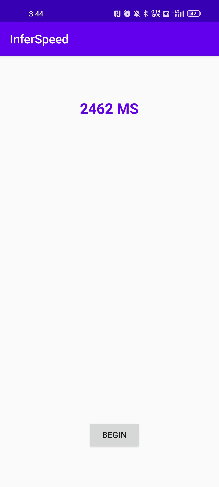

# Pytorch Model Speed Test on Android Platform

## Introduction

PyTorch mobile supports model inference on Android and iOS platforms. This app is modified from the official demo to implement a model speed test on Android.

## Prerequisites

* PyTorch 1.10 or later (Optional)
* Python 3.8 (Optional)
* Android Pytorch library 1.10 or later
* Android Studio 4.0.1 or later

## Quick Start

### 1. Prepare the Model 

To convert your own model with this code:
```
from torch.utils.mobile_optimizer import optimize_for_mobile
ts_model = torch.jit.script(model)
optimized_torchscript_model = optimize_for_mobile(ts_model)
optimized_torchscript_model.save("yourmodel.pt")
```

### 2. Prepare your Data

```
np.savetxt('inputs.data',inputs.reshape(-1),fmt='%.18f')
```

`input` is the input to the model, if there are multiple inputs you need to export multiple data.

### 3. Run the Model on Android

First, drag and drop the `yourmodel.pt` model generated to the project's asset folder.

change the line of code in the project's MainActivity.java file from:
```
module = Module.load(assetFilePath(this, "model.pt"));
```
to
```
module = Module.load(assetFilePath(this, "yourmodel.pt"));
```

Run the app in Android Studio and you'll see the same image classification result.

After, drag and drop the `inputs.data` to project's asset folder

Change the line of code in the project's MainActivity.recognize file from:

```
inputs = loadData(MainActivity.assetFilePath(getApplicationContext(),"inputs.data"));//load data
long[] shape = new long[]{1,5,60,9}; // set the input shape
Tensor inputTensor = Tensor.fromBlob(inputs,shape); // transform float array into float tensor
mModule.forward(IValue.from(inputTensor),IValue.from(sendTensor),IValue.from(recTensor)).toTensor(); // feed into model(if you hava multi inputs you need send all inputs like this)
```


### 4. Build and run with Android Studio

run on your AVD or real Android device. See this [video](https://drive.google.com/file/d/11L5mIjrLn7B7VdwjQl5vJv3ZVK4hcYut/view?usp=sharing) for a screencast of the app running.


